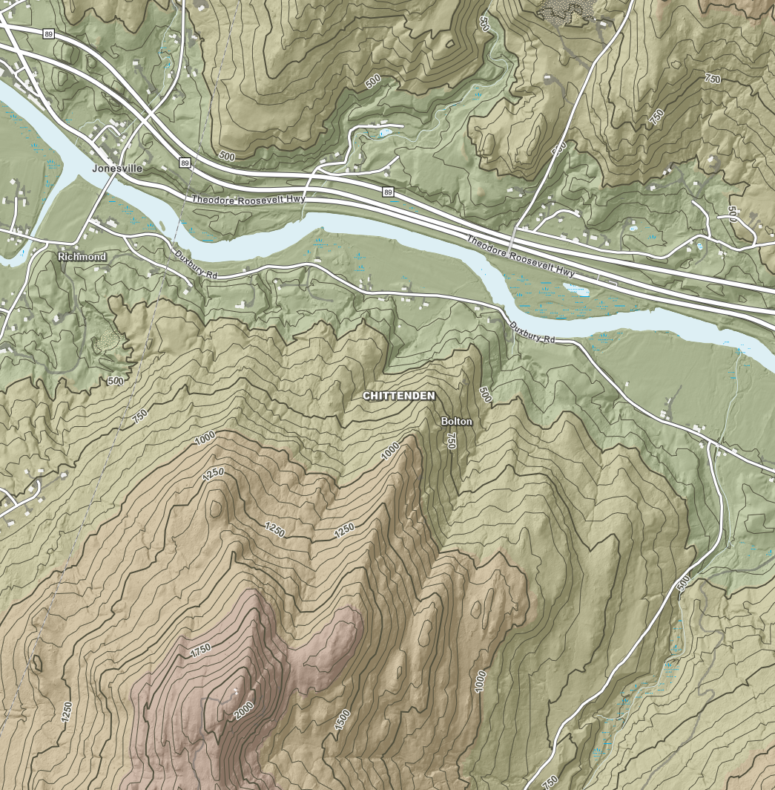

# DEM Color Ramp: 11-Class, Feet-Aligned Hypsometric Tint

**Status: saved/keeper version** — a good baseline to return to while
experimenting with alternatives. See [../README.md](../README.md) for the
list of ramp variants.

Color ramp for the hydro-flattened, QL1 lidar-derived statewide DEM
(`STATEWIDE_2023_35cm_DEMHF.tif`), designed to be blended with a hillshade
layer rather than used standalone.

## Source raster stats

- CRS: EPSG:6589 (NAD83(2011) / Vermont ftUS, horizontal)
- Pixel values: float32, **meters** (vertical units are meters despite the
  horizontal CRS being US survey feet)
- NoData: -999999
- Min: **-2.60 m** (-8.5 ft) — flooded quarry/depression, hydro-flattened
  water surface
- Max: **1339.65 m** (4,395 ft) — matches Mt. Mansfield's summit

## Design approach

This is a **classified (layer-tint) renderer** — 11 discrete elevation
classes, each a flat color, not a continuous gradient. Class breaks are
round feet values (finer near the valley floor and again near treeline,
500 ft steps in between) since this layer sits under contours labeled in
feet, so color transitions land close to major contour lines. The raster's
native vertical unit is meters, so break values are given in both feet (for
reference) and meters (for entry into ArcGIS Pro).

Colors follow Vermont's real ecological elevation zones (Champlain Valley
floor → foothills → montane forest → subalpine → alpine), desaturated and
kept in a mid-lightness band through the working elevation range so a
multiply/overlay hillshade blend still shows terrain texture; only the
alpine summit class goes near-white.

| Class | Range (ft) | Upper bound (m) | Zone | Hex | RGB |
|---|---|---|---|---|---|
| 1 | < 0 | 0.0 | Quarry/depression water | `#3B6E78` | 62,110,120 |
| 2 | 0–100 | 30.48 | Valley floor / riparian, lake-level | `#52927F` | 82,146,127 |
| 3 | 100–500 | 152.4 | Champlain Valley & lowland hills | `#7CA877` | 124,168,119 |
| 4 | 500–1000 | 304.8 | Foothills | `#9EB36F` | 158,179,111 |
| 5 | 1000–1500 | 457.2 | Lower mountain slopes | `#B8B36E` | 184,179,110 |
| 6 | 1500–2000 | 609.6 | Transition forest | `#C2A76B` | 194,167,107 |
| 7 | 2000–2500 | 762.0 | Mid-elevation forest (lower) | `#C99A6C` | 201,154,108 |
| 8 | 2500–3000 | 914.4 | Mid-elevation forest (upper) | `#BE8D71` | 190,141,113 |
| 9 | 3000–3500 | 1066.8 | Upper montane spruce-fir | `#AD8985` | 173,137,133 |
| 10 | 3500–4000 | 1219.2 | Subalpine/krummholz | `#C2A8A4` | 194,168,164 |
| 11 | > 4000 | 1339.65 (max) | Alpine summit | `#EDEAE5` | 237,234,229 |

Class 1's lower bound and class 11's upper bound are the raster's actual
min/max (-2.60 m / 1339.65 m); every other break is a round feet value.

## Files

- [`color-relief.txt`](color-relief.txt) — `gdaldem color-relief` format
  (elevation in meters, matching the raster's native vertical units), using
  doubled entries at each boundary so classes render as hard-edged flat
  bands rather than a smooth gradient. Usable directly with GDAL/QGIS, and
  as a reference table for manually building the ramp in other tools.
- [`titiler-colormap.json`](titiler-colormap.json) — TiTiler/rio-tiler
  "intervals" colormap format (a JSON list of `[[min, max], [r, g, b, a]]`
  pairs), elevation in meters, pretty-printed for readability. Unlike
  `color-relief.txt`, intervals here are naturally hard-edged (no
  doubled-entry trick needed) and the end classes are padded slightly
  (-50 m floor, 2000 m ceiling) past the DEM's actual -2.60 m/1339.65 m
  range so resampling/reprojection edge cases don't fall outside the
  defined colormap.
- [`titiler-colormap.min.json`](titiler-colormap.min.json) — same content,
  minified to one line with no whitespace. **Use this one when the
  colormap has to be embedded in a URL** (e.g. pasted into a tile-layer
  URL template) — see the ArcGIS Online gotcha below.

## Applying in TiTiler

Paste the contents of [`titiler-colormap.json`](titiler-colormap.json)
into the endpoint generator's custom colormap JSON field (not the color
formula field — that's for GDAL-style band-math expressions, which this
isn't). No rescale/color formula needed alongside it; the intervals
colormap is self-contained. If the tool round-trips the colormap through
a URL, it'll end up as the COG tile endpoint's `colormap` query parameter.

**ArcGIS Online gotcha (confirmed):** a URL with the pretty-printed
colormap (whitespace/newlines percent-encoded as `%20`/`%0A`) renders fine
when requested directly (confirmed via `curl` and in the TiTiler
preview), but **failed to render when added as a Tile Layer in ArcGIS
Online Map Viewer** — tiles silently didn't draw, no visible error.
Re-encoding the exact same colormap **minified** (no whitespace, see
[`titiler-colormap.min.json`](titiler-colormap.min.json)) fixed it. Root
cause not fully confirmed, but the working theory is that Map Viewer's
custom tile-layer URL handling decodes/re-encodes the pasted URL at some
point and doesn't correctly round-trip the whitespace-heavy percent
sequences in the pretty-printed version — the minified version has far
fewer of them. **Takeaway: always use the minified JSON when building a
TiTiler colormap URL for ArcGIS Online**, even though either form works
fine for direct requests or non-Esri (MapLibre/Leaflet) consumption.

## Applying in ArcGIS Pro

1. Add the raster layer, open **Symbology**, and set the primary symbology
   to **Classify**.
2. Set **Method** to **Manual**, and set **Classes** to `11`.
3. Open **Manage classes** and enter the upper-bound break values from the
   table above (in meters, since that's the raster's native unit):
   `0`, `30.48`, `152.4`, `304.8`, `457.2`, `609.6`, `762.0`, `914.4`,
   `1066.8`, `1219.2`, `1339.65` (or set the last one to the layer's actual
   max so it's not clipped).
4. For **Color scheme**, don't use an automatic ramp — click each class
   swatch individually and enter the hex/RGB value from the table so each
   class gets its exact assigned color.
5. Set the raster layer's blend mode (**Effects** tab) to **Multiply** or
   **Overlay** over the hillshade layer, and tune hillshade transparency to
   taste.

## Screenshots

Naming convention: `screenshots/<map-scale>_<location>.png` (map scale as
`1-N`, e.g. `1-16034` for 1:16,034). Add one per zoom level/location tested
so the ramp's behavior across scales stays visible over time.

### 1:16,034 — Chittenden/Bolton, Winooski River valley

## Revising

If a class boundary looks off over specific terrain (e.g., the 500–1000 ft
foothills band reads too similar to 1000–1500 ft), adjust that break value
or nudge the two colors further apart — the class breaks are the more
likely thing to need tuning per region, since real terrain rarely aligns
perfectly with round elevation numbers.
