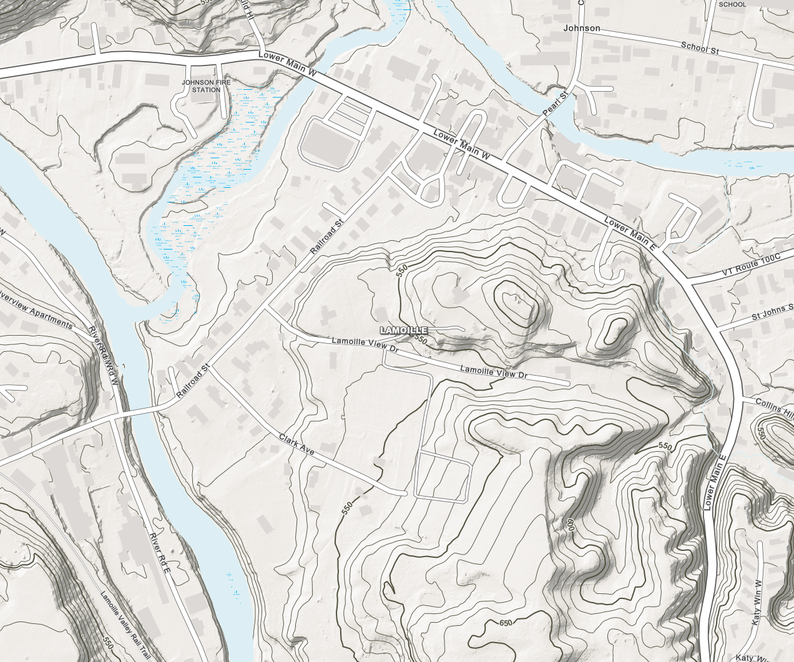

# DEM Color Ramp: 11-Class, Monochrome Canvas

Alternative to [`../11class-feet-aligned/`](../11class-feet-aligned/README.md),
designed for basemaps where users add their own thematic layers (points,
lines, polygons) on top. Uses the same 11 class breaks so the two variants
are directly comparable — only the colors differ.

## Context this was designed for

- DEM color ramp is applied at **50% opacity**.
- Underneath it is a QL1 lidar-derived hillshade, continuous stretch,
  min value 20 → max value 254, from `#E2E2E2` (light) to `#555656` (dark).
- Goal: keep the terrain layer as a quiet backdrop so overlay symbology
  (which is often saturated/categorical) stays the visual focus, and dark
  overlay symbols/labels stay legible over the whole map.

## Design approach

Single hue (~36°, warm neutral tan/parchment), varying only in lightness
across classes — no hue rotation like a hypsometric tint. Saturation is
held low (~18%) throughout. Lightness stays in a narrow, bright "canvas"
band (72–94%), similar in spirit to Esri's Light Gray Canvas or CARTO
Positron: well above the hillshade's darkest gray (`#555656` ≈ 34%
lightness), so even in shadowed terrain the blended result doesn't get
dark enough to threaten overlay legibility.

Elevation still reads (lighter = lower, slightly deeper tan = higher), but
subtly — the ramp is meant to be felt more than seen, leaving contrast
"budget" for whatever layers get added on top.

Class breaks are identical to
[`11class-feet-aligned`](../11class-feet-aligned/README.md#design-approach):
round feet values, finer near the valley floor (0–100 ft) and near
treeline (3500–4000 ft), 500 ft steps in between.

| Class | Range (ft) | Upper bound (m) | Hex | RGB |
|---|---|---|---|---|
| 1 | < 0 | 0.0 | `#F2F0ED` | 242,240,237 |
| 2 | 0–100 | 30.48 | `#EEEBE7` | 238,235,231 |
| 3 | 100–500 | 152.4 | `#EAE6E1` | 234,230,225 |
| 4 | 500–1000 | 304.8 | `#E6E1DB` | 230,225,219 |
| 5 | 1000–1500 | 457.2 | `#E2DDD5` | 226,221,213 |
| 6 | 1500–2000 | 609.6 | `#DDD8CF` | 221,216,207 |
| 7 | 2000–2500 | 762.0 | `#D9D3C9` | 217,211,201 |
| 8 | 2500–3000 | 914.4 | `#D5CEC3` | 213,206,195 |
| 9 | 3000–3500 | 1066.8 | `#D1C9BD` | 209,201,189 |
| 10 | 3500–4000 | 1219.2 | `#CBC2B4` | 203,194,180 |
| 11 | > 4000 | 1339.65 (max) | `#C4BAAB` | 196,186,171 |

## Files

- [`color-relief.txt`](color-relief.txt) — `gdaldem color-relief` format,
  same doubled-entry technique as the keeper variant so classes render as
  hard-edged flat bands.

## Applying in ArcGIS Pro

Same workflow as the keeper variant — Classify renderer, Manual method,
11 classes, same break values (in meters) — just swap in the hex/RGB
values from the table above for each class swatch. See
[`11class-feet-aligned`](../11class-feet-aligned/README.md#applying-in-arcgis-pro)
for the full step-by-step.

## Companion layers

Colors for other basemap layers, designed to sit alongside this ramp
without competing with user-added thematic data. Same hue family (~36°)
as the terrain, distinguished by saturation/lightness/hue-shift rather
than by introducing an unrelated color:

| Layer | Fill | Outline |
|---|---|---|
| Buildings | `#DCD9D6` (220,217,214) — same hue, saturation dropped to ~8% so it reads as neutral "built" gray | `#C7C2BC` |
| Open space (parks/conserved land) | `#DFE7DA` (223,231,218) — hue shifted to soft sage (~95°), similar saturation/lightness to terrain | `#C3D0B9` |
| Contour lines | `#95805F` (149,128,95) — same hue family, ~48% lightness, ~22% saturation; dark enough to read over the lightest terrain classes without turning into a dark mass where contours are dense | Index contours (labeled) can go a touch darker, e.g. `#7A6650`, for hierarchy |

## Screenshots

Naming convention: `screenshots/<map-scale>_<location>.png` (map scale as
`1-N`, e.g. `1-4203` for 1:4,203). Add one per zoom level/location tested
so the ramp's behavior across scales stays visible over time.

### 1:4,203 — Lamoille (Johnson), contour line color test

## Revising

If it reads as *too* flat/washed out once real overlay data is on top,
the two easiest dials are: widen the lightness range (push class 11
darker) or add a slight hue shift at just the top class or two (e.g. a
touch cooler/grayer right at treeline) to mark the alpine zone without
reintroducing a full hypsometric palette.
